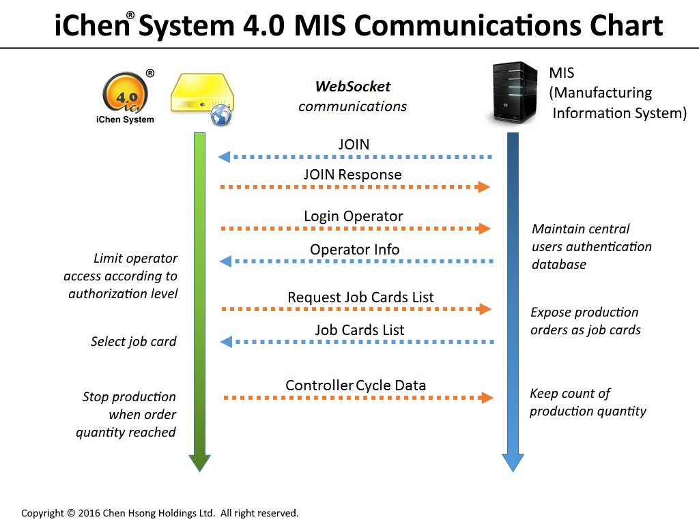

iChen® System 4.1 MIS/MES Integration Guide
=============================================

Copyright &copy; Chen Hsong Holdings Ltd.  All rights reserved.  
Document Version: 4.1  
Last Edited: 2018-01-23

A Machine is NOT an Island
--------------------------

When a machine is connected via a network to the iChen® System 4.1, it can integrate
with the MIS (Manufacturing Information System) or MES (Manufacturing Execution
System) of the factory.  When integrated, the
machine stops being a stand-alone *island*, but instead becomes part of a larger, coherent scheme.

An MIS/MES communicates with the iChen® Server via the [Open Protocol™](https://github.com/chenhsong/OpenProtocol/blob/master/cs/doc/api_reference.md).

The MIS/MES must [JOIN](https://github.com/chenhsong/OpenProtocol/blob/master/cs/doc/messages_reference.md#joinmessage) to the iChen® Server
with a password that has the required authority (see [here](https://github.com/chenhsong/OpenProtocol/blob/master/doc/enums.md#filters)
for details).

The iChen® Server sends Open Protocol™ messages to the MIS/MES and the MIS/MES
responds with appropriate reply messages:

Integrated Security
-------------------

Normally, the controller on a machine controls access via a number of *password levels*,
with higher levels having wider access powers than lower levels. Typically, an password
level of zero indicates no authority to do anything on the machine.

Manually updating and managing password levels on multiple machines is time-consuming,
resource-intensive and error-prone. It is also a significant security risk - for example,
it is usually infeasible to change all the passwords on each machine each time when a
staff has resigned or been transferred, and to redistribute the new passwords to all remaining staff.
As a result, machine access in a typical production environment is usually kept loose,
difficult to track and trace.

The iChen® System 4.1 provides *audit trail* features that automatically logs each and every
single change of setting made on each connected machine, as well as logging each and every
alarm condition that ever occurred.  Even though this provides tremendous value for tracing
out problems *after they happened*, it does not help in tracking *who* was responsible for
the changes, and certainly does not help in *preventing* unauthorized changes in the first place.

In order to provide *centrally-controlled* authentication and authorization, the
iChen® System 4.1 can integrate with the MIS/MES for complete lock-down and control of access
to all machines.

When a machine is connected to the iChen® System 4.1, the internal *password levels* stored in
its controller are **disabled** in favor of centralized security. Therefore, no operator can
gain access to a machine that is connected to the iChen® System 4.1 by entering an internal
password.

The operator instead must enter a password that is unique to him/her only, and not shared by anybody
else in the company. Essentially, the operator's personal password *identifies* the person involved.
Some companies integrate *staff card readers* to machine controllers and dispense with the need to
manually enter passwords altogether.

Upon receiving the personal password of the operator, the iChen® System 4.1 sends to the MIS/MES a
[`LoginOperatorMessage`](https://github.com/chenhsong/OpenProtocol/blob/master/cs/doc/messages_reference.md#loginoperatormessage) message containing
that password (or the staff number read from a staff badge).
Upon receiving this message, the MIS/MES should authenticate the operator by checking in its
centralized database of valid passwords, and matching a unique *operator ID* to the operator.

If authenticated, the MIS/MES should send an [`OperatorInfoMessage`](https://github.com/chenhsong/OpenProtocol/blob/master/cs/doc/messages_reference.md#operatorinfomessage)
message to the iChen® System 4.1.  This message should contain information regarding the
authorization of that particular operator:

* Unique, numeric, non-zero operator ID *(some controllers display this information on-screen)*
* Name of the operator *(some controllers display this information on-screen)*
* Access level from zero (no access rights) to ten (full access rights)

Upon receiving this reply message, the iChen® System 4.1 instructs the machine to recognize
the appropriate access level of the operator, in addition to logging the operator's ID for
records.

If the password provided to the MIS/MES cannot be authenticated (i.e. if the password does not
match any in its database), the MIS/MES should simply ignore this request or reply with
an [`OperatorInfoMessage`](https://github.com/chenhsong/OpenProtocol/blob/master/cs/doc/messages_reference.md#operatorinfomessage) containing
an *operator ID* of zero and an *access level* of zero.

When a staff member resigns and is transferred to another position,
his/her password can simply be disabled from within the MIS/MES, and
the staff can no longer gain access to any machine.

Integrated Job Scheduling
-------------------------

A machine can participate in the capacity planning of an MIS/MES, the MIS/MES is joined to
the iChen® Server with a password that has the `JobCards` authority
(see [here](https://github.com/chenhsong/OpenProtocol/blob/master/doc/enums.md#filters) for details).

The MIS/MES allocates and schedules units of work to individual machines via the concept
of *Job Cards*.

A *Job Card* is single *unit of work* to be performed by one single machine.
It can represent a single *production order*, or *part* of a production order that 
is allocated among certain number of machines during a particular time.
The MIS/MES system is responsible for tracking, allocating and scheduling machines to
satisfy 

Typically a *job card* is identified by a unique textual ID value (which typically 
contains the unique *order number* that is it part of).  Examples of job card ID's:

> `ORDER12345-5-003`  *(The third machine for the first line item of order #12345)*
> 
> `C987-X2016(03)-42-005/008`  *(The fifth machine out of eight allocated to batch 42 of order `X2016(03)` of customer #987)*
>
> `JKB-135/63`  *(63rd item for project code `JKB-135`)*

A job card also typically contains at least the following pieces of information:

* The unique serial number of a machine to perform the workload
* The unique textual ID of a mold to use for production
* The total quantity of products to be produced (or, when divided by the number of cavities in the specified mold, the number of production cycles)

When connected to the iChen® System 4.1, a number of additional screens are enabled on
a machine. The machine *requests* a valid list of job cards from the MIS/MES by sending
the [`RequestJobCardsListMessage`](https://github.com/chenhsong/OpenProtocol/blob/master/cs/doc/messages_reference.md#requestjobcardslistmessage)
message with the machine's serial number.

Upon receiving the [`RequestJobCardsListMessage`](https://github.com/chenhsong/OpenProtocol/blob/master/cs/doc/messages_reference.md#requestjobcardslistmessage)
message, the MIS/MES should search through its internal scheduling system and present the
machine with all the valid job cards for that particular machine at that particular
time of request.

Typically, only one job card is allocated to an individual machine
at any time, so in most cases the list will contain only one job card item.
In rare cases, when new ad-hoc jobs are inserted into the normal production 
schedule (i.e. *barge-in*), the list may contain more than one job card for
the operator to choose from; however, in the interest of reducing operator errors,
such practice should be avoided.

Depending on the authority of the operator, the machine typically should refuse
to start production unless a valid job card is loaded. This can greatly reduce
operator errors.

The MIS/MES provides the list of valid job cards to the iChen® System 4.1 via a
[`JobCardsListMessage`](https://github.com/chenhsong/OpenProtocol/blob/master/cs/doc/messages_reference.md#jobcardslistmessage) message.
See also [here](https://github.com/chenhsong/OpenProtocol/blob/master/cs/doc/messages_reference.md#job-card) for the format of each job card.

Each job card contains the unique ID of a mold to use. The machine then loads
the set of parameter settings for the specified mold. Depending on the authority
of the operator, he/she may not have authority to alter these settings, or may
have only limited authority to alter certain settings but not others.
This can greatly reduce operator errors during setup.

Each job card also contains the total quantity to be produced. Each piece of product
counts as one, and so for multi-cavity molds, the total number of production cycles
to be performed is the total quantity divided by the number of cavities.

The machine counts the quantity of "good" products produced, and when the requested quantity
is fulfilled, the machine stops production and transit to an idle state.
Depending on the authority of the operator, the machine may refuse to continue
production beyond the requested quantity. This can greatly reduce the amount of
over-production and wastage due to operator oversight.

In order to facilitate the above-mentioned quantity control, the MIS/MES should provide
the current quantity already produced for each job card in addition to the total requested
quantity. The machine, upon loading the job card, resets its internal "good" parts
count to this quantity and starts incrementing from that.

The MIS/MES is also responsible for up-keeping the current quantity produced for each job card
based on counting the cycle data messages sent by the machine
(see [here](https://github.com/chenhsong/OpenProtocol/blob/master/cs/doc/messages_reference.md#cycledatamessage) for details).
In order to receive cycle data messages, the MIS/MES must be joined to the iChen® Server
with a password that has the `CycleData` authority (see [here](https://github.com/chenhsong/OpenProtocol/blob/master/doc/enums.md#filters)
for details).
The machine is not supposed to track job card quantity numbers on a permanent basis;
it is the responsibility of the MIS/MES to do so.

Integrated Mold Management
--------------------------

The iChen® System 4.1 stores mold settings data locally and automatically serves the
correct data set upon request by a machine's controller, transcoding the data sets
wherever necessary to the appropriate versions acceptable by the requesting controller.

The iChen® System 4.1 also *backs up* the mold data sets to secure, protected and
fault-tolerant cloud storage to ensure that no critical data is ever lost.
All these are performed automatically and behind-the-scene.
Normally, the MIS/MES does not need to care about this.

In certain circumstances, however, the MIS/MES would like to maintain such mold data sets
centrally.  There are a few ways to accomplish this:

### (1) Request Live Mold Data

The MIS/MES sends a [`RequestMoldDataMessage`](https://github.com/chenhsong/OpenProtocol/blob/master/cs/doc/messages_reference.md#requestmolddatamessage)
to the iChen® System 4.1 for a particular machine (based on that machine's unique
serial number), which will respond with a 
[`MoldDataMessage`](https://github.com/chenhsong/OpenProtocol/blob/master/cs/doc/messages_reference.md#molddatamessage) containing the current
settings data of the specified machine in the form of an binary array.
The MIS/MES can then store this data centrally.

### (2) Use the Mold Data REST API

The iChen® System 4.1 exposes a [REST API](https://github.com/chenhsong/iChen.Web/blob/master/REST%20API%20Reference.md) that allows the
MIS/MES to inspect, add and delete stored mold data sets. It is up to the MIS/MES to synchronize
its mold data sets database with that in the iChen® System 4.1.

### (3) Mold Data Integration Module (Optional)

An optional *Mold Data Integration Module* can be installed in the iChen® System 4.1
to completely by-pass its internal mold data storage, always going to the MIS/MES instead.

The *Mold Data Integration Module* is a separately-charged product.
